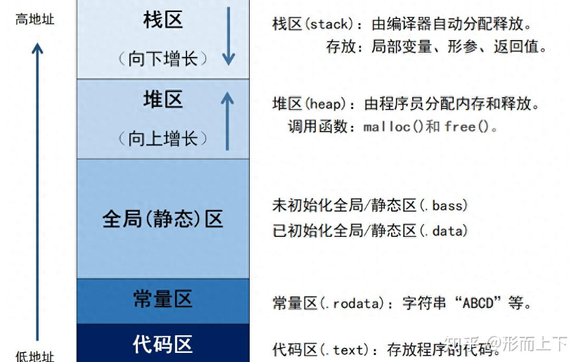
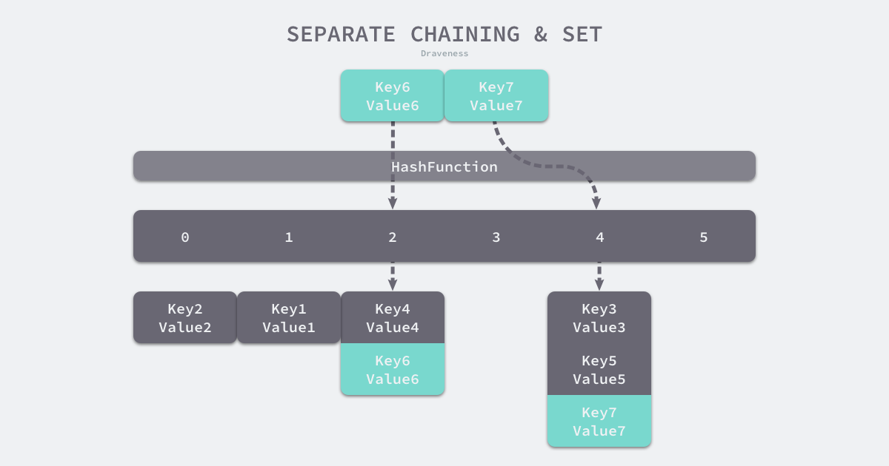

## C语言内存分区



## go切片和数组

切片是动态数组，其长度并不固定，我们可以向切片中追加元素，它会在容量不足时自动扩容。

## go append函数的使用

```
var x []int

x = append(x, 1) // 追加一个元素
x = append(x,2,3,4) //追加多个元素
x = append(x, []int{5,6,7}...) //追加一个新的切片

```

如果原来slice capacity足够大的情况下，append()函数会创建一个新的slice，它与old slice共享底层内存
如果原来的slice没有足够的容量添加内容，则创建一个新的slice，这个slice是copy的old slice。不与old slice共享内存
因此为了保险，我们通常将append返回的内容赋值给原来的slice： x = appen(x,…)

## Go语言copy()：切片复制（切片拷贝）

```
格式：copy( destSlice, srcSlice []T) int

slice1 := []int{1, 2, 3, 4, 5}
slice2 := []int{5, 4, 3}
copy(slice2, slice1) // 只会复制slice1的前3个元素到slice2中
copy(slice1, slice2) // 只会复制slice2的3个元素到slice1的前3个位置

```

## 哈希函数和哈希表

几乎所有的语言都会有数组和哈希表两种集合元素，有的语言将数组实现成列表，而有的语言将哈希称作字典或者映射。哈希表是计算机科学中的最重要数据结构之一，这不仅因为它 *[Math Processing Error]* 的读写性能非常优秀，还因为它提供了键值之间的映射。

实现哈希表的关键点在于哈希函数的选择，哈希函数的选择在很大程度上能够决定哈希表的读写性能。在理想情况下，哈希函数应该能够将不同键映射到不同的索引上，这要求**哈希函数的输出范围大于输入范围**，但是由于键的数量会远远大于映射的范围，所以在实际使用时，这个理想的效果是不可能实现的。

**完美哈希函数**

比较实际的方式是让哈希函数的结果能够尽可能的均匀分布，然后通过工程上的手段解决哈希碰撞的问题。哈希函数映射的结果一定要尽可能均匀，结果不均匀的哈希函数会带来更多的哈希冲突以及更差的读写性能。

**冲突解决**

哈希函数输入的范围一定会远远大于输出的范围，所以在使用哈希表时一定会遇到冲突，哪怕我们使用了完美的哈希函数，当输入的键足够多也会产生冲突。常见方法的就是开放寻址法和拉链法。

**开放寻址法**

是一种在哈希表中解决哈希碰撞的方法，这种方法的核心思想是**依次探测和比较数组中的元素以判断目标键值对是否存在于哈希表中**，当我们向当前哈希表写入新的数据时，如果发生了冲突，就会将键值对写入到下一个索引不为空的位置。当 Key3 与已经存入哈希表中的两个键值对 Key1 和 Key2 发生冲突时，Key3 会被写入 Key2 后面的空闲位置。当我们再去读取 Key3 对应的值时就会先获取键的哈希并取模，这会先帮助我们找到 Key1，找到 Key1 后发现它与 Key 3 不相等，所以会继续查找后面的元素，直到内存为空或者找到目标元素。哈希表里存的不只是 value，而是 (key, value) 对。读取时必须再次比较 key

开放寻址法中对性能影响最大的是**装载因子**，它是数组中元素的数量与数组大小的比值

**拉链法**

与开放地址法相比，拉链法是哈希表最常见的实现方法，大多数的编程语言都用拉链法实现哈希表

实现拉链法一般会使用数组加上链表，不过一些编程语言会在拉链法的哈希中引入红黑树以优化性能，拉链法会使用链表数组作为哈希底层的数据结构，我们可以将它看成可以扩展的二维数组



在一个性能比较好的哈希表中，每一个桶中都应该有 0~1 个元素，有时会有 2~3 个，很少会超过这个数量。计算哈希、定位桶和遍历链表三个过程是哈希表读写操作的主要开销，使用拉链法实现的哈希也有装载因子这一概念，拉链法的装载因子越大，哈希的读写性能就越差。

如果有 1000 个桶的哈希表存储了 10000 个键值对，它的性能是保存 1000 个键值对的 1/10，但是仍然比在链表中直接读写好 1000 倍。

**哈希表解决了什么核心矛盾**

我希望像数组一样快（O(1)访问） 但我的 key 不是整数下标，而是字符串、对象、任意类型

**哈希表初始化**

```
hash := map[string]int{
	"1": 2,
	"3": 4,
	"5": 6,
}

hash := make(map[string]int, 3)
hash["1"] = 2
hash["3"] = 4
hash["5"] = 6
```

**哈希表读写操作**

```go
_ = hash[key]

for k, v := range hash {
    // k, v
}

v     := hash[key] // => v     := *mapaccess1(maptype, hash, &key)
v, ok := hash[key] // => v, ok := mapaccess2(maptype, hash, &key)
```

## GO make函数

```
make(type, length, capacity)
```

- **type**：要创建的类型，可以是 `slice`、`map` 或 `channel`。
- **length**（可选）：数据结构的初始长度，适用于 `slice` 和 `channel`。
- **capacity**（可选）：数据结构的容量，适用于 `slice`，如果不指定，容量默认等于长度。

## GO string

原始字符串：双引号"识别转义字符，反引号`原生形式输出

```
	str3 := "我要换行\n换好啦:)\n"
	str4 := `我想换行\n换不了:(\n`
```

返回子串

```
	fmt.Println("world[:3] world1[3:]:",world[:3],world1[3:])
```

拼接：使用+，放不下时，+保留在上一行

```
	str5 := str1+world+
		str2+world1
```

遍历：中文是3个取一次，否则没意义。推荐使用for range方式，有字符和中文时都可以。

```
	for i:=0;i<len(world1);i=i+3{
		fmt.Print(world1[i:i+3])
	}
	for _,s := range world1{
		fmt.Printf("%c",s)
	}
```

